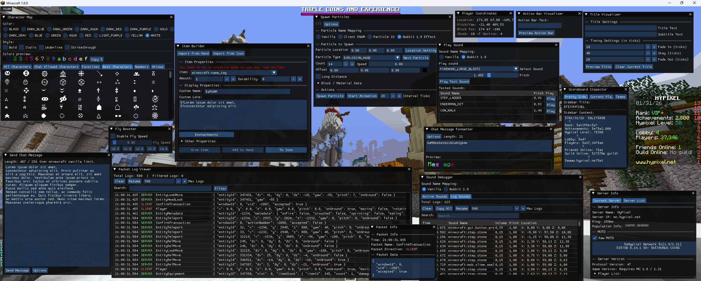
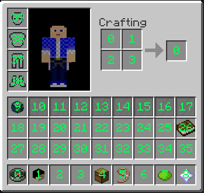
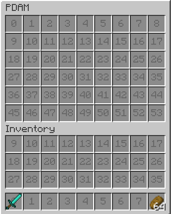

# Plugin Development Assistance Minecraft Mod (PDAM)

A mod for Minecraft 1.8.9, designed to assist with server plugin development and configuration.

## Features
- **Item NBT Inspector**: Displays an item's NBT data in its tooltip.
- **Sound Debugger**: Logs all played sounds to the console for debugging purposes.
- **Invisible Entity Highlighter**: Makes invisible entities visible for easier debugging.
- **Entity Information Panel**: Displays an on-screen panel with real-time information about the entity you are looking at.
- **Skin Extraction**: Extract skins from players and heads.
- **Copy Chat Messages**: Allows copying chat messages to clipboard by holding CTRL and clicking on the message.
- **Packet Monitoring**: Monitors and logs incoming and outgoing packets for debugging purposes.
- **Character Map**: Provides a GUI to browse and copy characters.
- **Hologram Mockup**: Edit personal hologram for prototyping preview.
- **Scoreboard Inspector**: Displays scoreboard information on-screen for easier debugging.
- **Sign Editor**: New GUI for writing on signs.
- **Fly Booster**: Enhances flying speed.
- **Chat Message Formater**: Preview how messages appear in chat.
- **Item Builder**: Create and customize items.
- **Inventory Slot Inspector**: Overlays index numbers on inventory slots.

## Installation
1. Ensure you have Minecraft Forge for version 1.8.9 installed.
2. Download the latest version of the mod from the GitHub Releases page.
3. Place the downloaded `.jar` file into your `.minecraft/mods` folder.
4. Launch Minecraft using the Forge profile.

## Building from Source
1. Clone this repository to your local machine.
2. Navigate to the project's root directory.
3. Run the appropriate command for your operating system to build the project: 
`./gradlew clean build`
4. The compiled `.jar` file will be located in the `build/libs/` directory.

## Example Screenshot

  

### Inventory Slot Overlay Screenshots
<table border="0">
  <tr>
    <td></td>
    <td></td>
  </tr>
  <tr>
    <td align="center">Inventory Slot Overlay - Background</td>
    <td align="center">Inventory Slot Overlay - Foreground</td>
  </tr>
</table>

---
*Project template: [Forge1.8.9Template](https://github.com/nea89o/Forge1.8.9Template)*