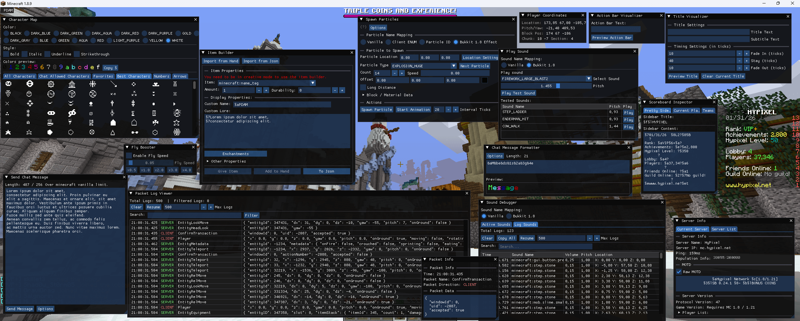
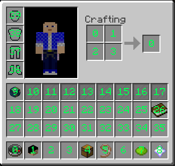
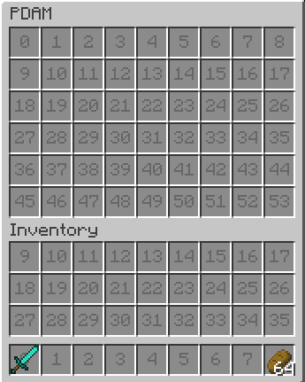
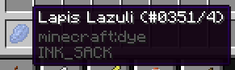
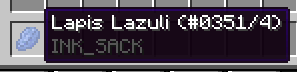
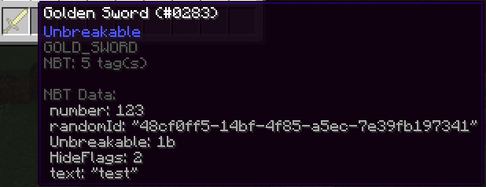

# Plugin Development Assistance Minecraft Mod (PDAM)

A mod for Minecraft 1.8.9, designed to assist with server plugin development and configuration.

## Features
- **Item NBT Inspector**: Displays an item's NBT data in its tooltip. ([screenshots](#item-nbt-inspector))
- **Sound Debugger**: Logs all played sounds to the console for debugging purposes.
- **Invisible Entity Highlighter**: Makes invisible entities visible for easier debugging.
- **Entity Information Panel**: Displays an on-screen panel with real-time information about the entity you are looking at.
- **Skin Extraction**: Extract skins from players and heads.
- **Particle Effect Previewer**: Allows previewing particle effects in the world. ([video](#particle-effect-previewer))
- **Copy Chat Messages**: Allows copying chat messages to clipboard by holding CTRL and clicking on the message.
- **Packet Monitoring**: Monitors and logs incoming and outgoing packets for debugging purposes.
- **Character Map**: Provides a GUI to browse and copy characters.
- **Hologram Mockup**: Edit personal hologram for prototyping preview.
- **Scoreboard Inspector**: Displays scoreboard information on-screen for easier debugging.
- **Sign Editor**: New GUI for writing on signs.
- **Fly Booster**: Enhances flying speed.
- **Chat Message Formater**: Preview how messages appear in chat.
- **Item Builder**: Create and customize items.
- **Inventory Slot Inspector**: Overlays index numbers on inventory slots. ([screenshots](#inventory-slot-overlay-screenshots))
- **Sign Finder**: Finds and highlights signs in the world.
- **Item Name Debugger**: Replaces the item's vanilla name with a mapped name. ([screenshots](#item-name-debug-screenshots))
- **BungeeCord Bypass**: Allows bypassing BungeeCord restrictions for testing purposes.
- **Hitbox Visualizer**: Visualizes entity hitboxes for easier debugging.
- And more...

## Planned Features
- **Server-Side Integration**
    - [ ] **Visual Scripting**: A node-based logic system inspired by Unreal Engine Blueprints for creating plugin behaviors visually.
    - [ ] **Content Management**: In-game interfaces to dynamically create, edit, and remove server-side content directly from the client.    - [ ] Configuration
    - [ ] **Configuration Editor**: Live-edit plugin configurations and settings through an intuitive in-game GUI.
    - [ ] **Particle Animation Studio**: A visual editor to design, preview, and export complex particle effects.
    - [ ] **Armor Stand Modeler**: Advanced tools for posing, equipping, and building detailed Armor Stand structures with precision.
- **Exploit Testing**: Expand testing tools to identify, reproduce, and mitigate known server vulnerabilities and exploits.
- **Localization Support**: Finalize comprehensive multi-language support for all mod interfaces and features.
- **Performance Analyzer**: Built-in profiling tools to monitor and analyze server and client performance metrics to identify bottlenecks.

## Installation
1. Ensure you have Minecraft Forge for version 1.8.9 installed.
2. Download the latest version of the mod from the GitHub Releases page.
3. Place the downloaded `.jar` file into your `.minecraft/mods` folder.
4. Launch Minecraft using the Forge profile.

**Compatibility Note:**
- **LabyMod 3**: Supported with the installation of the Forge version.
- **LabyMod 4**: Not supported due to conflicts with the ImGui Java dependency.

## Building from Source
1. Clone this repository to your local machine.
2. Navigate to the project's root directory.
3. Run the appropriate command for your operating system to build the project:
   `./gradlew clean build`
4. The compiled `.jar` file will be located in the `build/libs/` directory.

## Example Screenshot
Various feature GUIs being displayed.

  

### Particle Effect Previewer

  
🎬 Video Demonstration

   

  

    <b>Usage Demonstration</b> 
    <video src="https://github.com/user-attachments/assets/ea8fe5f5-f4f3-4929-bb15-8351288c910d" width="80%"></video>
  

  

    <b>Colored particles showcase</b> 
    <video src="https://github.com/user-attachments/assets/3c146739-496a-455a-b59f-9b50d639b98d" width="80%"></video>
  

### Inventory Slot Overlay Screenshots
<table border="0">
  <tr>
    <td align="center">Background</td>
    <td align="center">Foreground</td>
  </tr>
  <tr>
    <td></td>
    <td></td>
  </tr>
</table>

### Item Name Debug Screenshots
Replaces the item's vanilla name with a mapped name.
<table border="0">
  <tr>
    <td align="center">Bukkit 1.8 Mapping</td>
    <td align="center">Bukkit 1.8 Mapping - Override</td>
  </tr>
  <tr>
    <td></td>
    <td></td>
  </tr>
</table>

### Item NBT Inspector

## Third-Party Libraries
- **[Dear ImGui](https://github.com/ocornut/imgui)** by [ocornut](https://github.com/ocornut): Bloat-free Graphical User interface for C++ with minimal dependencies. Used for the visual interface.
- **[ImGui-java](https://github.com/SpaiR/imgui-java)** by [SpaiR](https://github.com/SpaiR): JNI-based binding for Dear ImGui.
- **[Sponge Mixin](https://github.com/SpongePowered/Mixin)**: A trait/mixin and bytecode weaving framework for Java.

---
*Project template: [Forge1.8.9Template](https://github.com/nea89o/Forge1.8.9Template)*
